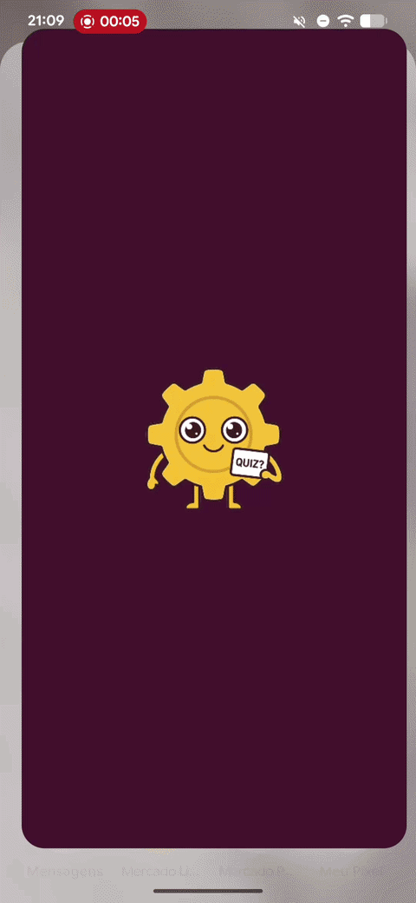
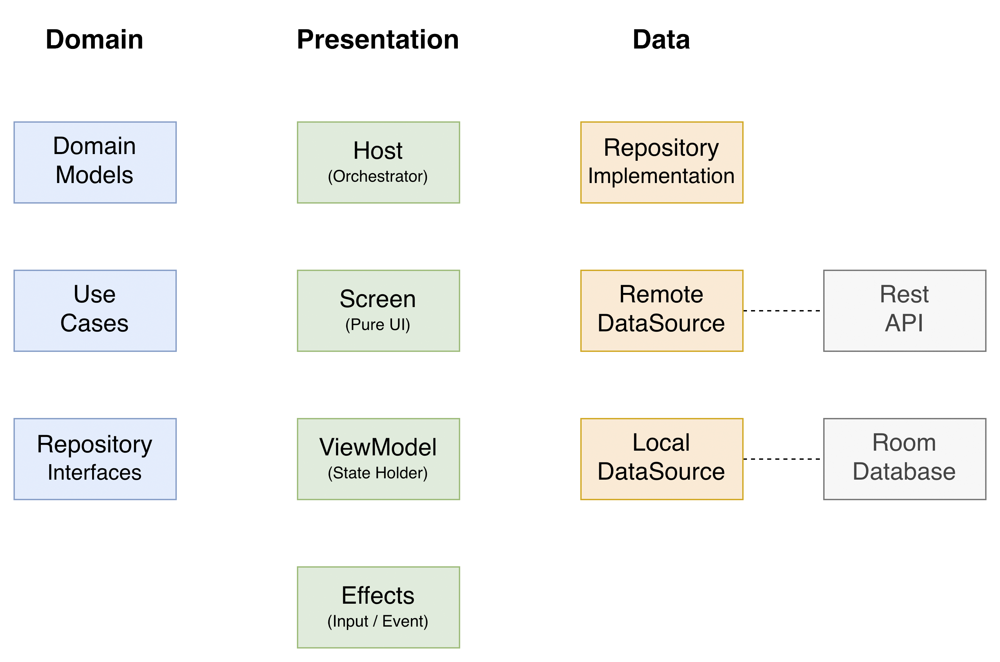
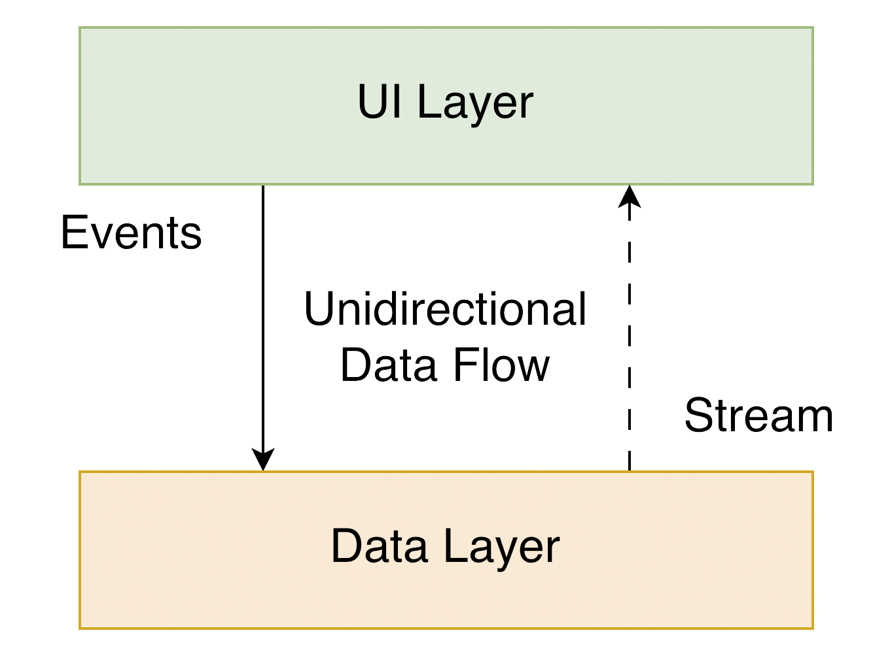
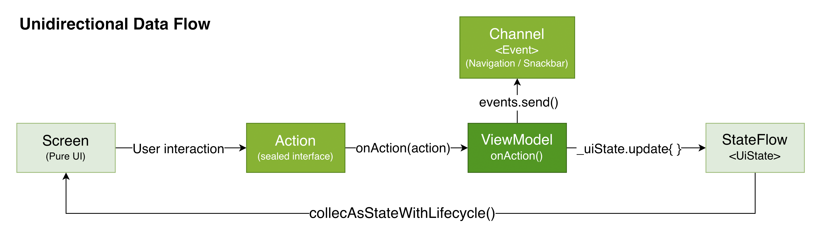

<div align="center">

# Dynaquiz

[](https://kotlinlang.org)
[](https://www.jetbrains.com/lp/compose-multiplatform/)
[](https://insert-koin.io)
[]()
[](https://android-arsenal.com/api?level=24)
[]()
[](https://opensource.org/licenses/MIT)

A **Kotlin Multiplatform** quiz application targeting **Android and iOS**, built with Compose Multiplatform. The app fetches questions from a public REST API, presents them under different challenge modes (Relaxed / Easy / Medium / Hard), times the user's answers, and tracks player progress on a persisted leaderboard. Architecture follows MVVM with MVI principles + Clean Architecture, with a single-source-of-truth UI state powered by unidirectional data flow (UDF).

<table>
  <tr>
    <td align="center"><br/><b>Android</b></td>
    <td align="center"><br/><b>iOS</b></td>
  </tr>
</table>

</div>

## Highlights

- **Cross-platform from a single Kotlin codebase** — Android and iOS share 100% of business logic, domain, data, and UI through Compose Multiplatform. Native modules only host the Compose root.
- **Server warmup on Splash** — fires a silent, fire-and-forget request during the splash animation to wake cold-started backend instances, hiding cold-start latency before the user reaches the Quiz.
- **Adaptive score formula** — points combine a base value with a time-remaining bonus, both weighted per mode (`basePoints + timeRemainingSec × timeBonusPerSecond`). See [Score Formula](#score-formula).
- **Next-question prefetching** — while the user reads and answers the current question, the next one is fetched in background via `Deferred<Question?>`, masking network latency between questions.
- **Difficulty-aware mascot** — the quiz screen renders a different mascot mood (`Relaxed` → `Noob` → `Normal` → `Expert`) based on the difficulty chosen, providing visual feedback.
- **Split persistence strategy** — preferences (last nickname, last challenge mode) live in `Multiplatform Settings`, and quiz session history lives in `SQLDelight`. Each store solves a specific concern.
- **Shared element transitions** — the brand title and purple panel animate seamlessly from the centered Splash position into the Home top bar using `SharedTransitionLayout`.

## Tech Stack

Built with modern Kotlin Multiplatform tooling.

**Core:**

- **[Kotlin 2.3+](https://kotlinlang.org/)** — Modern, expressive multiplatform programming language
  - **[Coroutines](https://kotlinlang.org/docs/coroutines-overview.html)** — Asynchronous programming
  - **[Flow](https://kotlinlang.org/docs/flow.html)** — Reactive data streams
  - **[Serialization](https://kotlinlang.org/docs/serialization.html)** — JSON parsing for DTOs and route arguments
  - **[kotlinx.datetime](https://github.com/Kotlin/kotlinx-datetime)** — Cross-platform date/time
  - **[kotlinx.collections.immutable](https://github.com/Kotlin/kotlinx.collections.immutable)** — Immutable collections for Compose stability

**UI:**

- **[Compose Multiplatform](https://www.jetbrains.com/lp/compose-multiplatform/)** — Declarative UI shared across Android and iOS
- **[Material 3](https://m3.material.io/)** — Component library and theming
- **[Compose Navigation Multiplatform](https://www.jetbrains.com/help/kotlin-multiplatform-dev/compose-navigation.html)** — Type-safe navigation with `@Serializable` routes
- **[Compose Resources](https://github.com/JetBrains/compose-multiplatform/blob/master/tutorials/Resources/README.md)** — Multiplatform image and string resources

**Networking:**

- **[Ktor 3](https://ktor.io/)** — Multiplatform HTTP client
  - `ktor-client-okhttp` on Android
  - `ktor-client-darwin` on iOS
- **[Ktor Content Negotiation](https://ktor.io/docs/serialization.html)** + `kotlinx.serialization` — JSON handling

**Persistence:**

- **[SQLDelight 2](https://cashapp.github.io/sqldelight/2.0.2/multiplatform_sqlite/)** — Typesafe SQLite with platform-specific drivers
- **[Multiplatform Settings](https://github.com/russhwolf/multiplatform-settings)** — Key-value storage (SharedPreferences on Android, NSUserDefaults on iOS)

**Dependency Injection:**

- **[Koin 4.1](https://insert-koin.io/)** — Lightweight multiplatform DI

**Architecture:**

- **[Clean Architecture](https://blog.cleancoder.com/uncle-bob/2012/08/13/the-clean-architecture.html)** — Domain / Data / Presentation separation, dependencies pointing inward
- **MVVM with MVI principles** — Single source of truth via UDF: UI emits intents, ViewModel produces immutable state
- **Single Activity / Single ViewController** — modern declarative navigation approach

**Build:**

- **[Gradle Kotlin DSL](https://docs.gradle.org/current/userguide/kotlin_dsl.html)** — Type-safe build scripts
- **[Version Catalogs](https://docs.gradle.org/current/userguide/platforms.html#sub:version-catalog)** — Centralized dependency management
- **[BuildKonfig](https://github.com/yshrsmz/BuildKonfig)** — Build-time constants (API base URL)

## Architecture

**Dynaquiz** follows MVVM + MVI + Clean Architecture, aligned with [Google's official architecture guidance](https://developer.android.com/topic/architecture).



### Architecture Overview



The architecture is structured into three distinct layers: Presentation, Domain, and Data. Each layer has specific responsibilities, and dependencies always point inward (features depend on core, never the other way around).

| Layer | Folder(s) | Responsibility |
|-------|-----------|----------------|
| **Domain** | `core/domain/` | Models, repository interfaces, use cases, AppResult/AppError |
| **Data** | `core/data/` | Repository implementations, data sources (remote and local), DTOs, mappers, error translation |
| **Presentation** | `feature/splash/`, `feature/home/`, `feature/difficulty/`, `feature/quiz/`, `feature/result/`, `feature/ranking/` | MVVM + MVI: Host/Screen/Effects, Contract, ViewModel |

- Each layer follows [Unidirectional Data Flow](https://developer.android.com/topic/architecture/ui-layer#udf): the UI emits intents to the ViewModel, and the ViewModel exposes state as a stream via `StateFlow`.
- The Data layer follows the [Single Source of Truth](https://en.wikipedia.org/wiki/Single_source_of_truth) principle.
- The Domain layer has no Android/iOS framework dependencies — pure Kotlin.

### Presentation Layer



This layer is closest to what the user sees on the screen. It combines `MVVM` structure with `MVI` behavior through `UDF` (Unidirectional Data Flow):

- `MVVM` — `ViewModel` encapsulates UI state and exposes it via an observable state holder (`StateFlow`)
- `MVI` — User intentions are modeled as `Intents` (sealed interface), processed through a single `onIntent()` entry point, producing a new immutable `UiState` — forming a unidirectional cycle: UI → Intent → ViewModel → State → UI

The state is a single source of truth per screen. State is collected via `collectAsStateWithLifecycle()`, ensuring [lifecycle-aware collection](https://medium.com/androiddevelopers/consuming-flows-safely-in-jetpack-compose-cde014d0d5a3) with no wasted resources. All state types are annotated with [`@Immutable`](https://developer.android.com/reference/kotlin/androidx/compose/runtime/Immutable) to enable Compose composition optimizations.

The UI layer implements the **Host / Screen / Effects** pattern:

- **Host** (e.g. `QuizHost`) — Root composable that orchestrates the feature. Injects the ViewModel via `koinViewModel()` (with parameters for routed args), collects state with `collectAsStateWithLifecycle()`, and wires together `IntentEffects`, `EventEffects`, and `Screen`. The Host is the only composable that knows about the ViewModel.
- **Screen** (e.g. `QuizScreen`) — Pure UI composable. Receives only immutable data (`UiState`) and an `onIntent` callback. Has no access to the ViewModel, making it independently testable by passing static state.
- **ViewModel** (e.g. `QuizViewModel`) — Processes user intents and emits state changes. Exposes a single public method `onIntent()` as the entry point for all user intentions. All internal logic is `private`. Uses `MutableStateFlow` internally, exposed as immutable `StateFlow`.
- **IntentEffects** (e.g. `QuizIntentEffects`) — Triggers initial intents on first composition (e.g., `Started` to start the countdown).
- **EventEffects** (e.g. `QuizEventEffects`) — Consumes one-shot events that are not state (navigation, snackbar) via `Channel<Event>`. Events are consumed once and discarded, avoiding re-execution on recomposition.
- **Contract** (e.g. `QuizContract`) — Defines the complete UI contract for the feature in a single file.

Each feature defines a **Contract** with four types:

| Type | Responsibility |
|------|---------------|
| **UiState** | Current screen state — a `data class` annotated with `@Immutable`, serving as the single source of truth |
| **Intent** | User intentions (e.g., `AnswerSelected`, `BackPressed`) — a `sealed interface` consumed by `onIntent()` |
| **Event** | One-shot effects like navigation and snackbar — a `sealed interface` emitted via `Channel` |
| **Message** | Message types for user-facing display (e.g., error messages) — a `sealed interface` resolved to `String` in EventEffects |

### Domain Layer

Independent of any other layer and free of framework dependencies. Domain models and business logic remain decoupled — changes in the Data layer (e.g. swapping Ktor for another HTTP client) or in the UI never propagate here.

**Components:**

- **UseCase** — Single-operation business logic. Uses `operator fun invoke()` for natural call-site syntax (e.g., `getRandomQuestionUseCase()`) and returns `AppResult<T>` when fallible. Examples:
  - `GetRandomQuestionUseCase` — fetches a single random question
  - `SubmitAnswerUseCase` — submits an answer and returns the outcome
  - `SaveQuizSessionUseCase` — persists a completed session
  - `GetRankingUseCase` / `GetMyRankingUseCase` — read the leaderboard
  - `GetLastChallengeModeUseCase` / `SetLastChallengeModeUseCase` — read/write the selected difficulty
  - `RegisterOrFetchPlayerUseCase` — find-or-create player by nickname
  - `WarmupServerUseCase` — wakes up the backend on app launch
- **Domain Models** — Core data structures: `Question`, `AnswerResult`, `AnswerLog`, `ChallengeMode`, `Mascot`, `Player`, `Score`, `QuizSessionResult`, `RankingEntry`. Value classes like `QuestionId` and `PlayerId` enforce type safety.
- **Repository Interfaces** — `QuizRepository`, `RankingRepository`, `ChallengeModeRepository`, `UserRepository`, `PlayerRepository`. Required to keep the Domain layer independent from the Data layer ([Dependency Inversion](https://en.wikipedia.org/wiki/Dependency_inversion_principle)).
- **AppResult** — A `sealed interface` (`Success<T>` / `Error`) that encapsulates fallible operation outcomes, ensuring the UI never sees raw exceptions.
- **AppError** — A `sealed interface` defining known error types (`NoInternet`, `ServerError`, `NotFound`, etc.), providing a type-safe error hierarchy.

### Data Layer

Encapsulates application data. Provides data to the Domain layer through a combination of remote (REST API) and local (SQLite + key-value preferences) sources.

| Component | Implementation |
|-----------|----------------|
| **Repository** | `QuizRepositoryImpl`, `RankingRepositoryImpl`, `ChallengeModeRepositoryImpl`, `UserRepositoryImpl`, `PlayerRepositoryImpl` — orchestrate data sources and expose `AppResult<T>` to the Domain |
| **Remote Data Source** | `QuizRemoteDataSource` — Ktor-based REST client for the Dynamox Quiz API |
| **Local Data Sources** | `PlayerLocalDataSource`, `QuizSessionLocalDataSource` — SQLDelight queries; `ChallengeModeLocalDataSource` — Multiplatform Settings wrapper |
| **DTO Models** | `QuestionDTO`, `AnswerRequestDTO`, `AnswerResultDTO` — serialization annotations for Ktor + kotlinx.serialization |
| **Mappers** | Extension functions like `QuestionDTO.toDomain()`, `SelectRanking.toDomain()`, keeping Domain free of `Data`-layer types |
| **Error Translation** | `Throwable.toAppError()` — converts `IOException`, `HttpException`, `SocketTimeoutException` etc. into typed `AppError`s |

The mapping pipeline follows: `DTO (API) → Domain Model ↔ Entity (SQLDelight)`. Settings stored values are also mapped through `ChallengeMode.fromSerializedNameOrThrow()` to recover typed enums from strings.

## Quiz-Specific Features

### Score Formula

Points per correct answer combine a **base value** with a **time bonus**, both weighted by the challenge mode:

```
score = basePoints + (timeRemainingSec × timeBonusPerSecond)
```

| Mode | Base | Bonus/sec | Time | Max/question | Max session (10) |
|------|------|-----------|------|--------------|------------------|
| Relaxed | 1 | 0 | — | 1 | **10** |
| Easy | 2 | 1 | 30s | 32 | **320** |
| Medium | 4 | 2 | 20s | 44 | **440** |
| Hard | 8 | 5 | 10s | 58 | **580** |

The formula is intentionally tuned so harder modes always reward more points than easier ones — even when answering at the last possible second.

The score itself is wrapped in a `value class Score(val points: Int)` with `+` and `compareTo` operator overloads, enabling expressive ranking logic without `Int` confusion.

### Server Warmup

The Dynamox Quiz API runs on a free-tier cloud instance that **sleeps after inactivity**. To hide cold-start latency, `WarmupServerUseCase` is dispatched on Splash via `viewModelScope.launch` , a fire-and-forget HTTP request that wakes the server before the user reaches the Quiz screen. Failures are silently ignored.

### Question Prefetching

While the user reads or answers the current question, the **next question is fetched in background** through a `Deferred<Question?>` stored in the `QuizViewModel`. When the user submits, the next question is typically already in memory and the transition feels instant.

```kotlin
private var prefetchedNextQuestion: Deferred<Question?>? = null

private fun schedulePrefetchOfNextQuestion() {
    prefetchedNextQuestion?.cancel()
    val nextIndex = _uiState.value.currentQuestionIndex + 1
    prefetchedNextQuestion = if (nextIndex < QuizRules.TOTAL_QUESTIONS) {
        viewModelScope.async { fetchQuestion() }
    } else null
}
```

If the prefetch hasn't completed by the time the user advances, the existing `Deferred.await()` simply blocks until the network resolves, the same behavior as a reactive fetch, with no worse-case regression.

### Difficulty-Aware Mascot

Each `ChallengeMode` owns a default `Mascot` visible during selection on the Difficulty screen, quiz and result, forming a small but expressive mascot system.

### Shared Element Transitions

The brand title (mascot logo + "Dynaquiz" text) and the purple background panel animate seamlessly between Splash and Home using `SharedTransitionLayout` and `Modifier.sharedBounds`. The lockup that starts centered on Splash slides into the Home top bar, while the purple panel collapses from full-screen down to the top bar height — both synchronized to a single `tween` curve.

### Persistence Strategy

Two distinct stores, each serving a specific purpose:

| Store | Backed by | Used for |
|-------|-----------|----------|
| **Settings** | `Multiplatform Settings` (no-arg) — SharedPreferences on Android, NSUserDefaults on iOS | User preferences: last nickname, last selected challenge mode |
| **SQLDelight** | SQLite via SQLDelight 2 — Android Driver / Native Driver on iOS | Quiz session history (player + score + mode + finished date) — populates the Ranking |

This split keeps preferences cheap and instantly accessible (no query overhead) while sessions live in a relational, queryable store optimized for the leaderboard's ordered reads.

## Project Structure

Dynaquiz is a **single-module KMP project** with feature-based folder organization inside `composeApp`:

```
dynaquiz/
├── composeApp/
│   ├── src/
│   │   ├── commonMain/
│   │   │   ├── kotlin/com/leanite/dynaquiz/
│   │   │   │   ├── App.kt
│   │   │   │   ├── core/
│   │   │   │   │   ├── data/
│   │   │   │   │   │   ├── datasource/        # Ktor + SQLDelight + Settings wrappers
│   │   │   │   │   │   ├── repository/        # Repository implementations
│   │   │   │   │   │   ├── mapper/            # DTO/Entity ↔ Domain
│   │   │   │   │   │   ├── error/             # Throwable.toAppError()
│   │   │   │   │   │   └── model/             # DTOs
│   │   │   │   │   ├── domain/
│   │   │   │   │   │   ├── model/             # Question, Mascot, ChallengeMode, Score, ...
│   │   │   │   │   │   ├── repository/        # Repository interfaces
│   │   │   │   │   │   ├── usecase/
│   │   │   │   │   │   └── result/            # AppResult, AppError
│   │   │   │   │   ├── di/                    # Koin core module
│   │   │   │   │   └── ui/
│   │   │   │   │       ├── common/            # GameBackground, GameButton, GameTopBar, Mascot, ...
│   │   │   │   │       └── theme/             # Color palette, typography, DynaquizTheme
│   │   │   │   ├── feature/
│   │   │   │   │   ├── splash/                # Host, Screen, ViewModel, Contract, Effects, anim, di, res
│   │   │   │   │   ├── home/
│   │   │   │   │   ├── difficulty/
│   │   │   │   │   ├── quiz/
│   │   │   │   │   ├── result/
│   │   │   │   │   └── ranking/
│   │   │   │   └── navigation/
│   │   │   │       ├── DynaquizAppNavigation.kt
│   │   │   │       └── QuizNavKey.kt          # Type-safe routes
│   │   │   ├── composeResources/              # Drawables (mascot variants, background), strings
│   │   │   └── sqldelight/com/leanite/dynaquiz/database/
│   │   │       ├── Player.sq
│   │   │       └── QuizSession.sq
│   │   ├── androidMain/                       # MainActivity + Android-specific drivers
│   │   └── iosMain/                           # iOS-specific drivers and Compose entry point
│   └── build.gradle.kts
├── iosApp/                                    # Xcode project (ComposeUIViewController host)
├── gradle/libs.versions.toml                  # Version catalog
└── README.md
```

### Feature Module Structure

Each feature folder follows the **Host / Screen / ViewModel / Contract / Effects** pattern:

```
feature/quiz/
├── QuizHost.kt              # Orchestrator (connects ViewModel, Effects, Screen)
├── QuizScreen.kt            # Pure UI (receives UiState + onIntent)
├── QuizViewModel.kt         # State holder (onIntent as single public entry)
├── QuizContract.kt          # UiState, Intent, Event, Message + QuizPhase, QuizRules
├── QuizIntentEffects.kt     # Initial intents (LaunchedEffect)
├── QuizEventEffects.kt      # One-shot events (navigation, snackbar)
├── ui/                      # Internal composables
│   ├── CountdownDisplay.kt
│   ├── QuestionCard.kt
│   ├── OptionButton.kt
│   ├── TimerRing.kt
│   └── ExitQuizDialog.kt
├── res/QuizRes.kt           # Strings for this feature
└── di/FeatureQuizModule.kt  # Koin module
```

## Build & Run

### Android

```bash
# Debug build (APK)
./gradlew :composeApp:assembleDebug

# Install on connected device
./gradlew :composeApp:installDebug

# Unit tests
./gradlew :composeApp:testDebugUnitTest
```

### iOS

```bash
# Build the Compose framework for Xcode
./gradlew :composeApp:embedAndSignAppleFrameworkForXcode

# Then open and run from Xcode
open iosApp/iosApp.xcodeproj
# Cmd + R to run on a simulator or connected device
```

### Common Tasks

```bash
# Clean
./gradlew clean

# Refresh dependencies (useful when changing versions)
./gradlew --refresh-dependencies
```

### Build Configuration

The project uses [BuildKonfig](https://github.com/yshrsmz/BuildKonfig) to expose build-time constants under the `com.leanite.dynaquiz.config` package. Both constants have defaults baked into the build, so **the project compiles out of the box** and no `local.properties` setup is required to run.

| Constant | Default | 
|----------|---------|
| `DYNAMOX_QUIZ_BASE_URL` | `https://quiz-api-bwi5hjqyaq-uc.a.run.app` (public Dynamox endpoint) | 


## Open API

Dynaquiz uses the **Dynamox Quiz API** to fetch questions and submit answers.

Endpoints used:

- `GET /question` — Fetches a random question
- `POST /answer?questionId={id}` with body `{"answer": "<text>"}` — Submits an answer and returns `{"result": true/false}`

## Author

**Leandro Carneiro** — Android Developer learning Kotlin Multiplatform.

[](https://github.com/leanite)
[](https://www.linkedin.com/in/lcleite/)
